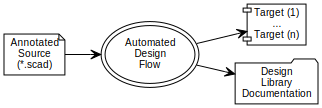

openscad-amu
============

> A design flow with compile automation and Doxygen doc generation for OpenSCAD...

It is a _framework_ and tools for automating the compilation of
[OpenSCAD] designs with a _pre-processor_ that allows __\*.scad__ to be
documented using [Doxygen].

Introduction
------------

[openscad-amu] is being developed to support the construction of
automated design flows with Doxygen-based documentation for [OpenSCAD]
language-based mechanical design. It establishes a framework that
enables documentation and build-scripts to be embedded into the
__\*.scad__ design source. It incorporates two distinct but
complementary features that may be used together or independently:

    (1) Design Compilation Automation, and
    (2) Design Documentation Generation.

In either case, design __\*.scad__ source files are augmented with
structured auxiliary comments.

Build scripts are automatically extracted at compile-time to construct
[Makefiles] that manage the design compilation. [openscad-amu] provides
source code filters that extend [Doxygen], and provides additional
[special commands] with features useful in mechanical design. The
design flow automates the documentation extraction and formatting for
each __\*.scad__ source with embedded [Doxygen] content.

<map name="adf.map" id="dot_inline_dotgraph_4.map">
<area shape="rect" id="node1" alt=""
      href="embedding.html"
      title="Annotated Design Source"
      coords="5,45,108,100"/>
<area shape="poly" id="node2" alt=""
      href="flow.html"
      title="Automated Design Flow"
      coords="282,73,279,59,270,47,256,37,238,31,219,29,199,31,182,37,168,47,159,59,156,73,159,86,168,99,182,108,199,115,219,117,238,115,256,108,270,99,279,86"/>
<area shape="rect" id="node3" alt=""
      href="https://royasutton.github.io/omdl/examples/solar_mount/psptm_build_all.stl"
      title="Dependency-based Target Generation"
      coords="342,5,428,60"/>
<area shape="rect" id="node4" alt=""
      href="https://royasutton.github.io/omdl/examples/solar_mount/index.html"
      title="Design Documentation Set"
      coords="330,84,440,139"/>
</map>

Any design with multiple components will significantly benefit when
using [openscad-amu]. The *targets* in the above diagram represent
design component parts or part variations. Compiling design targets
one-by-one is times consuming and error prone and discourages design
optimization and/or exploration.

For larger design projects, [openscad-amu] frees designers from mundane
dependency and part coherency tracking. Moreover, it greatly reduces
total project rendering time on multi-processor systems via parallel
invocations of the single-threaded [OpenSCAD] compiler. Once
compilation flows are described, using a simple scripting scheme, each
design target is kept current from source as needed via invocations of
`make`.

Getting Started
---------------

If you are already familiar with [Doxygen], adding basic documentation
to your [OpenSCAD] designs using [openscad-amu] is straight forward.
Simply markup each of your design files with the [special commands],
name each file in the [Project Makefile], and type `make` to generate
your documentation.

You can also start from a template created by the [bootstrap] script,
then customize as needed.

### Setup ###

See the GitHub source [repository] for setup instructions.

Example
-------

* [A Portable solar panel tripod mount](http://www.thingiverse.com/thing:2051608):

  This design took approximately 48 hours from concept to assembly and
  documentation using [omdl] and [openscad-amu]. It demonstrates the
  fully automated design flow. One can change a design parameter, then
  type `make all` to recompile all effected parts. In this design,
  parts are automatically engraved with the version and part identifier
  using a simple database scheme available in [omdl]. The design is
  published on [thingiverse](http://www.thingiverse.com/thing:2051608).

Contributing
------------

openscad-amu uses [git] for development tracking, and is hosted on
[GitHub] following the usual practice of [forking] and submitting
[pull requests] to the source [repository].

As it is released under the [GNU General Public License], any file you
change should bear your copyright notice alongside the original
authors' copyright notices typically located at the top of each file.

Contact and Support
-------------------

In case you have any questions or would like to make feature requests,
you can contact the maintainer of the project or file an [issue].

[GNU General Public License]: https://www.gnu.org/licenses/gpl.html
[Makefiles]: https://www.gnu.org/software/make

[openscad-amu]: https://royasutton.github.io/openscad-amu
[repository]: https://github.com/royasutton/openscad-amu
[issue]: https://github.com/royasutton/openscad-amu/issues

[bootstrap]: https://github.com/royasutton/openscad-amu#evaluation
[Project Makefile]: https://github.com/royasutton/openscad-amu#example-project

[omdl]: https://royasutton.github.io/omdl

[OpenSCAD]: http://www.openscad.org/

[Doxygen]: http://www.stack.nl/~dimitri/doxygen/index.html
[special commands]: http://www.stack.nl/~dimitri/doxygen/manual/commands.html

[git]: http://git-scm.com/
[GitHub]: http://github.com/
[forking]: http://help.github.com/forking/
[pull requests]: https://help.github.com/articles/about-pull-requests/
