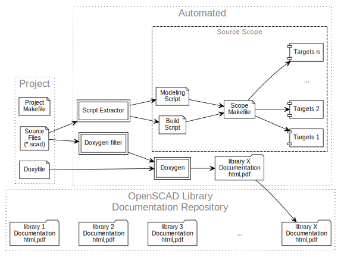

The Design Flow
---------------

A project includes a makefile, the project source files, and a Doxygen
configuration file (Doxyfile). Source files may be annotated with
documentation and/or build automation scripts. Each script is extracted
at compile time to generate a _scope_ makefile that controls the
generation of corresponding targets.

The documentation feature and build script automation feature may be
used independently or together and is configured in the project
makefile using the variable AMU_PM_COMPONENTS.

[openscad-amu] brings together [OpenSCAD], [Doxygen], [GNU Make], and
_custom scripting_ (based on [GNU Bash]) to automate the generation of
the design documentation and design targets.

[openscad-amu]: https://royasutton.github.io/openscad-amu
[OpenSCAD]: http://www.openscad.org
[Doxygen]: http://www.doxygen.nl
[GNU Make]: https://www.gnu.org/software/make
[GNU Bash]: https://www.gnu.org/software/bash
